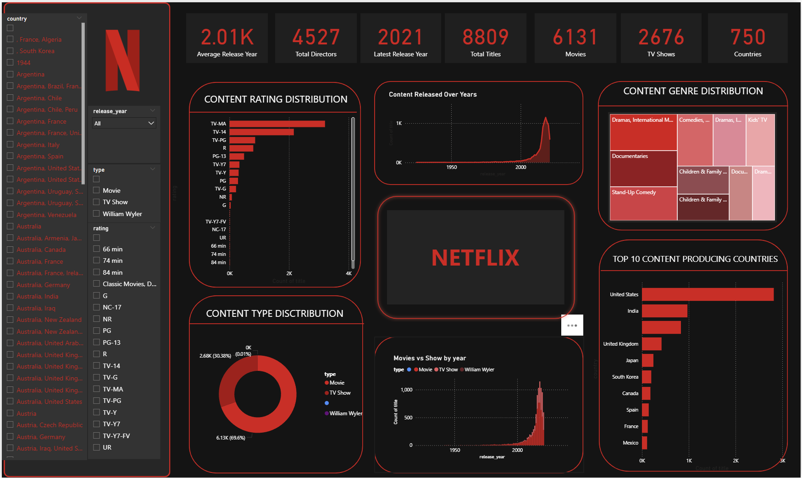

# Netflix Content Analysis Dashboard

## Project Overview

This project analyzes Netflix's content dataset to uncover patterns in movies and TV shows available on the platform. Using SQL for data analysis and Power BI for visualization, the dashboard provides insights into content distribution, production trends, and genre popularity.

The goal of this project is to demonstrate practical data analytics skills including data cleaning, SQL querying, and dashboard creation.

---

## Tools & Technologies Used

* **SQL (MySQL)** – Data querying and analysis
* **Power BI** – Interactive dashboard and data visualization
* **Dataset** – Netflix Titles Dataset (CSV format)

---

## Dataset Information

The dataset contains information about Netflix movies and TV shows including:

* Show ID
* Type (Movie or TV Show)
* Title
* Director
* Cast
* Country
* Date Added
* Release Year
* Rating
* Duration
* Genre (Listed In)
* Description

The dataset was imported into MySQL for SQL analysis and then connected to Power BI for visualization.

---

## Key Dashboard Metrics

The dashboard highlights important KPIs including:

* Total number of titles on Netflix
* Number of Movies and TV Shows
* Total number of countries producing content
* Total number of directors
* Latest release year in the dataset
* Average release year of content

---

## Dashboard Visualizations

The Power BI dashboard includes the following visual insights:

1. **Content Type Distribution** – Movies vs TV Shows
2. **Content Release Trend** – Number of titles released over the years
3. **Top Content Producing Countries** – Countries with the most titles
4. **Rating Distribution** – Breakdown of content ratings (TV-MA, TV-14, PG, etc.)
5. **Genre Distribution** – Most common genres available on Netflix
6. **Interactive Filters** – Filters by country, rating, release year, and type

The dashboard is styled using a **Netflix-themed design (Black & Red)** to resemble the Netflix interface.

---

## SQL Analysis Queries

Some of the key SQL queries used in this project include:

**Total Titles**

```sql
SELECT COUNT(*) AS total_titles
FROM netflix_titles;
```

**Movies vs TV Shows**

```sql
SELECT type, COUNT(*) AS total
FROM netflix_titles
GROUP BY type;
```

**Top 10 Countries Producing Content**

```sql
SELECT country, COUNT(*) AS total_titles
FROM netflix_titles
WHERE country IS NOT NULL
GROUP BY country
ORDER BY total_titles DESC
LIMIT 10;
```

**Rating Distribution**

```sql
SELECT rating, COUNT(*) AS total_titles
FROM netflix_titles
GROUP BY rating
ORDER BY total_titles DESC;
```

---

## Key Insights from the Analysis

* Movies make up the majority of content on Netflix compared to TV Shows.
* The United States produces the highest number of titles.
* Netflix content has grown rapidly after 2015.
* Certain genres like Drama and International Movies dominate the platform.
* Mature audience ratings such as TV-MA appear frequently in the dataset.

---

## Project Workflow

1. Collected Netflix dataset in CSV format
2. Imported dataset into MySQL database
3. Performed SQL queries to analyze the data
4. Connected MySQL database to Power BI
5. Built an interactive dashboard
6. Designed the dashboard using a Netflix-style theme

---

## Dashboard Preview


---

## Author

**Umang Singh**

B.Tech Computer Science Student
Aspiring Data Analyst

---

## Project Purpose

This project was created as part of a **data analytics portfolio** to demonstrate skills in:

* SQL data analysis
* Data visualization
* Business insight generation
* Dashboard design
